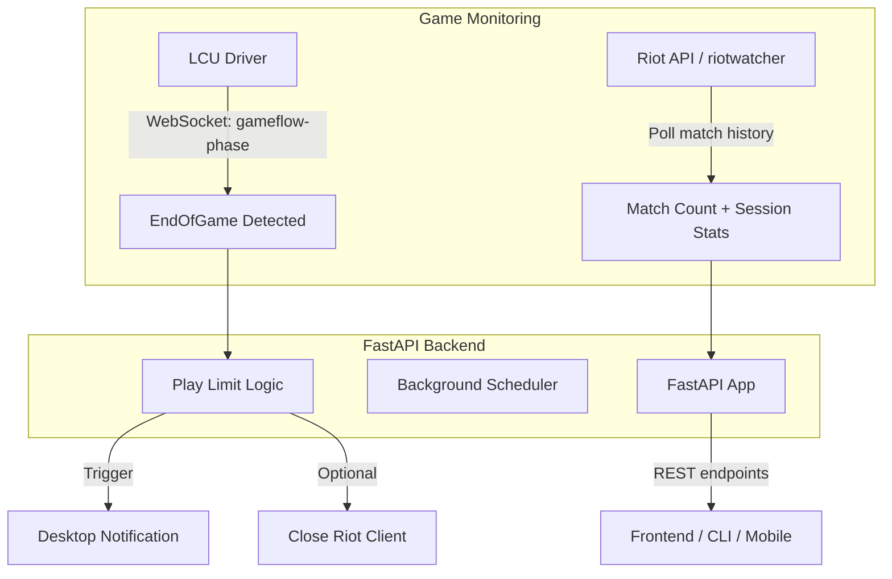

# TFT Monitor - Backend Plan

## Research Summary

### Do You Need the Riot API?

**Yes, but for different purposes than real-time detection:**

| Approach                    | Use Case                                       | Real-time? | Requirements                                        |
| --------------------------- | ---------------------------------------------- | ---------- | --------------------------------------------------- |
| **Riot API** (TFT Match v1) | Match count, session history, persistent stats | No         | API key (dev = 24h expiry; prod = app registration) |
| **LCU API** (League Client) | Detect when a game _ends_                      | Yes        | League client running + logged in; no API key       |

**Key finding:** The Riot API does **not** provide real-time in-game data. Match history is post-game only. To trigger play-time limits "after finishing a game" (not at launch), you need **LCU** to detect the `EndOfGame` phase. TFT runs inside the League client, so LCU applies to TFT as well.

---

## Architecture



---

## Monitoring Approaches

### 1. Riot API - Match Count and History

- **Library:** `riotwatcher` or `httpx` + manual requests
- **Endpoints:**
  - `GET /tft-match/v1/matches/by-puuid/{puuid}/ids` — list match IDs (paginated)
  - `GET /tft-match/v1/matches/{matchId}` — match details
- **Flow:** Poll periodically (e.g. every 60–120s when client is open), compare match count to detect new games.
- **Data:** Games played today, this session, total, timestamps.
- **API Key:** Dev key (24h) from [Riot Developer Portal](https://developer.riotgames.com/). Production needs app registration (separate TFT product).

### 2. LCU - Real-Time Game End Detection

- **Library:** `lcu-driver` (async, WebSocket support)
- **Endpoint:** `/lol-gameflow/v1/gameflow-phase`
- **Phases:** `InProgress` → `WaitingForStats` → `PreEndOfGame` → `**EndOfGame`
- **Flow:** Subscribe to gameflow-phase via WebSocket; when phase is `EndOfGame`, run play-time limit logic.
- **Requirement:** League client running and logged in. No Riot API key needed for LCU.
- **Caveat:** LCU is undocumented/unofficial; Riot asks you to register LCU apps in the dev portal.

---

## Play-Time Limiting Ideas (After Game Ends Only)

| Idea                          | How It Works                                                               | Pros                          | Cons                                                        |
| ----------------------------- | -------------------------------------------------------------------------- | ----------------------------- | ----------------------------------------------------------- |
| **Desktop notification**      | `plyer` or `pync` (macOS)                                                  | Non-intrusive, cross-platform | User can ignore                                             |
| **Graceful client quit**      | LCU `POST /lol-login/v1/session/quit` (or equivalent)                      | Clean exit, no kill           | May not exist for “quit game only”; might quit whole client |
| **Process termination**       | `psutil` to find and terminate `League of Legends.exe` / `Riot Client.exe` | Strong enforcement            | Aggressive; risk of data loss if game not fully saved       |
| **Session summary + lockout** | Show stats, then block re-queue for X minutes (e.g. via LCU if possible)   | Encourages breaks             | May require LCU features that don’t exist                   |
| **Configurable daily cap**    | Track games; at cap, show notification and optionally quit                 | Clear rule                    | Needs reliable game count (Riot API + LCU)                  |

**Recommendation:** Use **desktop notification** as the primary mechanism (low risk, works on macOS). Add **optional process closure** behind a config flag for stricter limits, with a short delay after `EndOfGame` to allow stats to save.

---

## Proposed Tech Stack

| Purpose         | Library                    | Notes                                               |
| --------------- | -------------------------- | --------------------------------------------------- |
| HTTP API        | FastAPI                    | Async, auto OpenAPI, modern Python                  |
| LCU connection  | lcu-driver                 | Async, WebSocket, handles auth from lockfile        |
| Riot API        | riotwatcher or httpx       | Match history, account lookup                       |
| Notifications   | plyer                      | Cross-platform desktop notifications                |
| Process control | psutil                     | Find and terminate Riot/League processes (optional) |
| Config          | pydantic-settings          | Env vars, `.env` support                            |
| Task scheduling | asyncio + background tasks | No Celery needed for this scope                     |

---

## Project Structure

```
TFTMonitor/
├── main.py                 # FastAPI app entrypoint
├── config.py               # Settings (API key, limits, flags)
├── requirements.txt
├── .env.example
├── app/
│   ├── __init__.py
│   ├── api/
│   │   ├── routes/
│   │   │   ├── games.py    # GET /games/count, /games/session, /games/history
│   │   │   └── limits.py   # GET/POST play limit config
│   │   └── deps.py
│   ├── services/
│   │   ├── riot_api.py     # Riot API client (match history)
│   │   ├── lcu_monitor.py  # LCU connection + gameflow watcher
│   │   ├── notifier.py     # Desktop notifications
│   │   └── play_limiter.py # Limit logic: notify / optional close
│   └── models/             # Pydantic models for API
└── scripts/
    └── run_monitor.py      # Optional: standalone monitor (no API)
```

---

## Implementation Phases

### Phase 1: Riot API Integration

- Get PUUID from summoner name + region (or store in config)
- Implement match history polling
- Endpoints: `GET /games/count`, `GET /games/session`, `GET /games/history`
- Store session state (start time, games this session) in memory or SQLite

### Phase 2: LCU Monitor

- Connect via lcu-driver using lockfile
- Subscribe to `gameflow-phase` WebSocket
- Emit internal event when phase transitions to `EndOfGame`
- Handle client disconnect/reconnect

### Phase 3: Play-Time Limiting

- Config: daily cap, session cap, enable notification, enable force-close
- On `EndOfGame`:
  - Increment session count (and persist if needed)
  - Check limits; if exceeded → show notification
  - If force-close enabled → delay 5–10s then terminate Riot/League process
- Desktop notifications via plyer

### Phase 4: FastAPI Wiring

- Background task to run LCU monitor when API starts
- REST routes for stats and limit config
- Health check that reports LCU connection status

---

## Open Questions / Decisions

1. **PUUID / Summoner lookup:** Will you provide summoner name + region in config, or do you want an onboarding endpoint to fetch and cache PUUID?
2. **Force-close target:** Terminate `Riot Client` (launcher) vs `League of Legends` (game) — closing the game client is safer; closing Riot Client affects all games.
3. **Data persistence:** In-memory only vs SQLite for session/daily counts across restarts.

---

## References

- [Riot TFT Match API](https://developer.riotgames.com/apis#tft-match-v1)
- [RiotWatcher TFT MatchApi](https://riot-watcher.readthedocs.io/en/latest/riotwatcher/TeamFightTactics/MatchApi.html)
- [lcu-driver Python](https://lcu-driver.readthedocs.io/)
- [LCU gameflow-phase (Pengu)](https://pengu.lol/guide/lcu-request)
- [Plyer notifications](https://plyer.readthedocs.io/)
